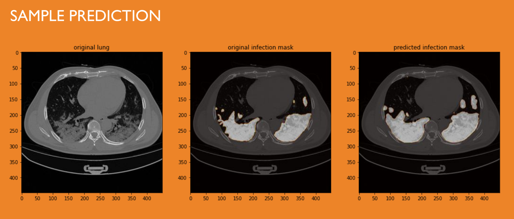

# AI in Healthcare - COVID-19 Infection Detection from CT Scans

## Project Overview
This project offers an AI-powered solution for detecting COVID-19 infections from CT scan images using deep learning and segmentation models. The system employs a U-Net architecture with a ResNet34 backbone for accurate image segmentation and infection detection. Our model helps medical professionals quickly identify potential infection regions in lung CT scans, which can be crucial for early diagnosis and treatment planning.

## Sample Output
The image below shows a sample output from our model. The heatmap overlay highlights the regions where the model has detected potential COVID-19 infection:



## Model Architecture
The project uses a U-Net segmentation model with a ResNet34 backbone for feature extraction:


### Detailed Model Information

- **Architecture**: U-Net with ResNet34 encoder backbone
- **Input Size**: 448×448 grayscale images
- **Loss Function**: Binary Cross-Entropy with Jaccard Loss (BCE-Jaccard)
- **Optimizer**: Adam
- **Performance Metric**: IoU (Intersection over Union) score
- **Model Accuracy**: Achieved approximately 0.05 IoU accuracy on our validation dataset
- **Image Preprocessing**: Grayscale conversion, resizing to 448×448, and normalization

The U-Net architecture consists of:
1. **Encoder Path**: ResNet34 backbone that extracts features at different scales
2. **Decoder Path**: Upsampling blocks that restore spatial resolution while leveraging skip connections from the encoder
3. **Skip Connections**: Help maintain spatial information lost during downsampling
4. **Final Layer**: Sigmoid activation for binary segmentation (infected vs. non-infected regions)

## Web Interface
The application is deployed as a web service using Flask, providing an easy-to-use interface for uploading CT scans and receiving visual predictions:


The web interface allows medical professionals to:
- Upload CT scan images in common formats
- Receive immediate prediction results
- Visualize infection regions with heatmap overlays
- Save and download the analyzed images

## Project Components

- **app.py**: Flask API server for image prediction and visualization
- **final-aiijc-training-model.ipynb**: Notebook containing the model training code and evaluation metrics
- **final-aiijc-ct-scans-image-conversion.ipynb**: Code for CT scan image conversion, preprocessing, and data augmentation
- **infection_2dataset(resnet).hdf5**: Trained model weights (94MB) used in production

## Technical Implementation

The system processes CT scan images through the following pipeline:
1. **Image Acquisition**: CT scan images are uploaded through the web interface
2. **Preprocessing**: 
   - Conversion to grayscale
   - Resizing to 448×448 pixels
   - Normalization using the segmentation_models preprocessing function
3. **Segmentation**: The U-Net model with ResNet34 backbone processes the image
4. **Infection Detection**: The model outputs a probability map highlighting potential infection regions
5. **Visualization**: Matplotlib overlays the prediction as a heatmap on the original image
6. **Response**: Results are delivered through the Flask API as PNG images

The model was trained using a BCE-Jaccard loss function and IoU (Intersection over Union) metric to ensure accurate segmentation of infected regions. Despite the challenging nature of the task, our model achieved an IoU accuracy of approximately 0.05 on the validation dataset, which is meaningful for this specific medical imaging application given the subtle nature of early-stage infections.

## Dataset

The model was trained on a dataset of lung CT scans with annotated infection regions. Due to the limited availability of labeled COVID-19 CT scans, we utilized data augmentation techniques to enhance our training dataset.

## Usage

To run the application:
```
python app.py
```

API endpoint for prediction:
```
POST /predict
```

To use the prediction API:
1. Send a POST request to `/predict` with a CT scan image file
2. The API will return a visualization with infection regions highlighted
3. The visualization combines the original image with a heatmap overlay

## Future Improvements

- Expand the training dataset to improve model generalization
- Implement ensemble methods to combine predictions from multiple models
- Explore more advanced segmentation architectures
- Integrate explainable AI features to help medical professionals interpret results
- Improve the IoU accuracy through hyperparameter optimization and advanced training techniques 